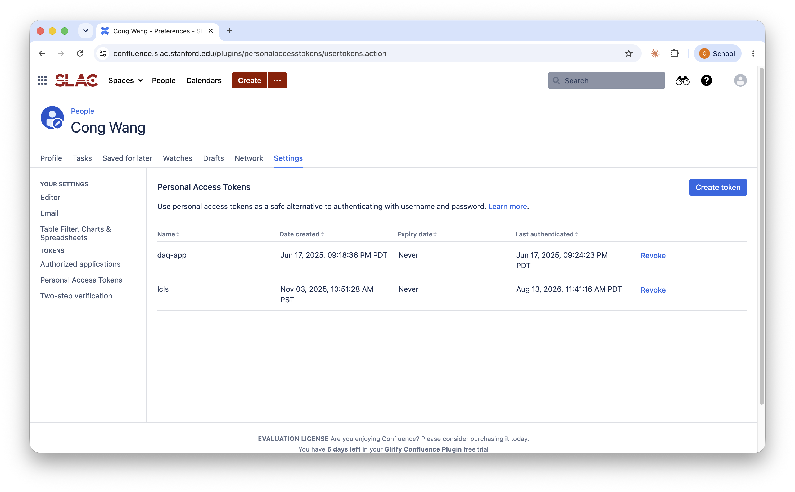
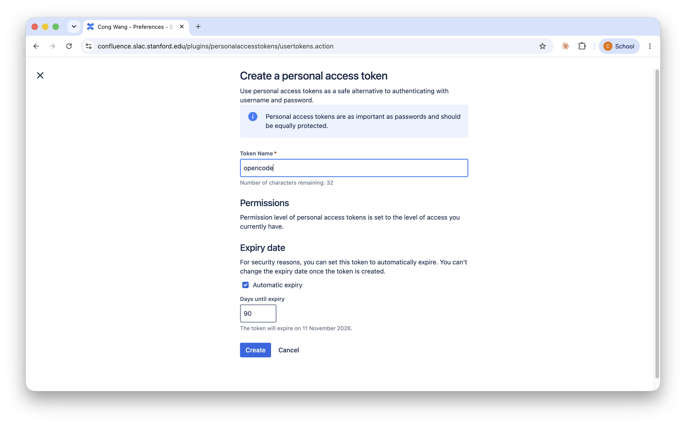
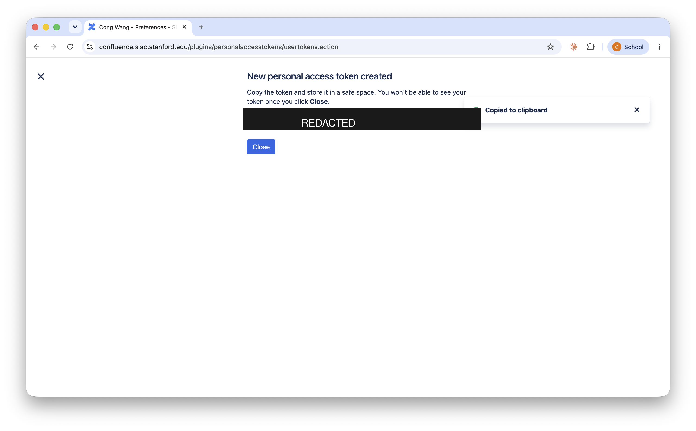

# Getting a Confluence personal access token

Every user of `confluence-search` needs their own token. This is not a
credential anyone can hand you: Confluence filters search results by the token
owner's permissions, so a shared token would show you someone else's view of the
wiki and hide pages you are entitled to read.

It takes about a minute. There is no way to automate the first token — this
instance has basic authentication disabled, so the REST API cannot mint one for
you. It has to be done in a browser.

## Before you start

- You need a working SLAC Confluence login at `confluence.slac.stanford.edu`.
- From outside SLAC, you will likely need the VPN before the site loads.

## 1. Open the token page

Go straight to:

```
https://confluence.slac.stanford.edu/plugins/personalaccesstokens/usertokens.action
```

Or navigate: your avatar (top right) → **Settings** → **Personal Access Tokens**,
under the **TOKENS** heading in the left sidebar.



You will see any tokens you already have, with the date created, expiry date, and
when each was last used. Each row has a **Revoke** link.

Click **Create token**, top right.

## 2. Fill in the form



**Token Name.** Name it after the thing that will use it, not after yourself —
you will eventually have several, and the name is how you tell them apart when
revoking. `opencode`, `claude-code`, and `laptop` are good; `token1` is not. The
field is limited to about 40 characters.

**Permissions.** Nothing to choose. The token inherits the access level you
already have. This is exactly why each person needs their own.

**Expiry date.** Tick **Automatic expiry** and set **Days until expiry**. 90 days
is a reasonable default; the form shows you the resulting date. Set this
deliberately — **you cannot change the expiry after the token is created**, and
a token with no expiry is a permanent credential that will outlive your interest
in it.

Click **Create**.

## 3. Copy the token — you get exactly one chance

Confluence now shows a **New personal access token created** dialog containing
the token value, and copies it to your clipboard automatically.



The token appears in the field that is blacked out above. It is masked here
deliberately: a picture of that dialog is a picture of a working password, and
screenshots of this screen are a common way tokens leak.

The warning in the dialog is literal — *"You won't be able to see your token once
you click Close."* Once you click **Close** the value is unrecoverable, and your
only option is to revoke the token and create another.

With the value on your clipboard, go straight to the next step. Do not paste it
into a text file, a chat message, a terminal command, or your shell profile on
the way.

## 4. Install it

`confluence-login` is not on your `PATH` — typing it bare gives
`command not found`. It ships inside the skill, so you run it by path, and the
path depends on where the skill was deployed for you:

```bash
# a personal Claude Code install
~/.claude/skills/confluence-search/scripts/confluence-login

# the shared LCLS opencode install on S3DF
/sdf/group/lcls/ds/dm/apps/dev/opencode/skills/confluence-search/scripts/confluence-login
```

Both are the same program. If you use both tools, you still install the token
only once — it goes to a single per-user file, not into either skill directory.

If you would rather type a short command, link it onto your `PATH` once:

```bash
mkdir -p ~/.local/bin
ln -s /sdf/group/lcls/ds/dm/apps/dev/opencode/skills/confluence-search/scripts/confluence-login \
      ~/.local/bin/confluence-login
```

It prompts without echoing, so nothing appears as you paste. It writes the token
to `~/.config/confluence-search/token` with mode 600, creating the directory as
700, and then makes one call to confirm the token works:

```
wrote /home/you/.config/confluence-search/token (mode 600)

Cong Wang <cwang31@slac.stanford.edu>
  instance: https://confluence.slac.stanford.edu
  token:    /home/you/.config/confluence-search/token
```

Seeing your own name means you are done.

## 5. Check the expiry actually took

Go back to the token page and look at the **Expiry date** column for your new
token. If it says **Never**, the automatic-expiry box was not ticked when you
submitted. You cannot fix that on an existing token — revoke it and create a
replacement.

## When it expires

Commands start failing with an HTTP 401, and the error tells you the token was
rejected. Mint a new one exactly as above, then install it over the old one:

```bash
<path-from-step-4>/confluence-login --force
```

`--force` is required because the command refuses to overwrite an existing token
by accident.

## Housekeeping

- **Revoke tokens you no longer use**, from the same page. A revoked token stops
  working immediately.
- **One token per tool.** If a laptop is lost or a service is retired, you revoke
  one token instead of re-minting everything.
- **Never put the token on a command line.** Process arguments are readable by
  other users on shared machines like the S3DF login nodes.
- **Never commit it, paste it into a ticket, or screenshot the creation dialog.**
  Treat the value exactly as you would your password — which is what Confluence
  itself says in the blue notice on the create form.

## Other ways to supply the token

`confluence-search` looks for the token in this order:

1. `$CONFLUENCE_TOKEN`
2. `$CONFLUENCE_TOKEN_FILE`
3. `~/.config/confluence-search/token` — the default, written by `confluence-login`

If you keep secrets in a password manager, you can skip the prompt and pipe it
in, which avoids the clipboard entirely:

```bash
pass show confluence | <path-from-step-4>/confluence-login
```

Setting `CONFLUENCE_TOKEN` in a shell profile also works, but puts the secret in
a dotfile that is easy to commit to a dotfiles repo by mistake. The token file is
the safer default.
